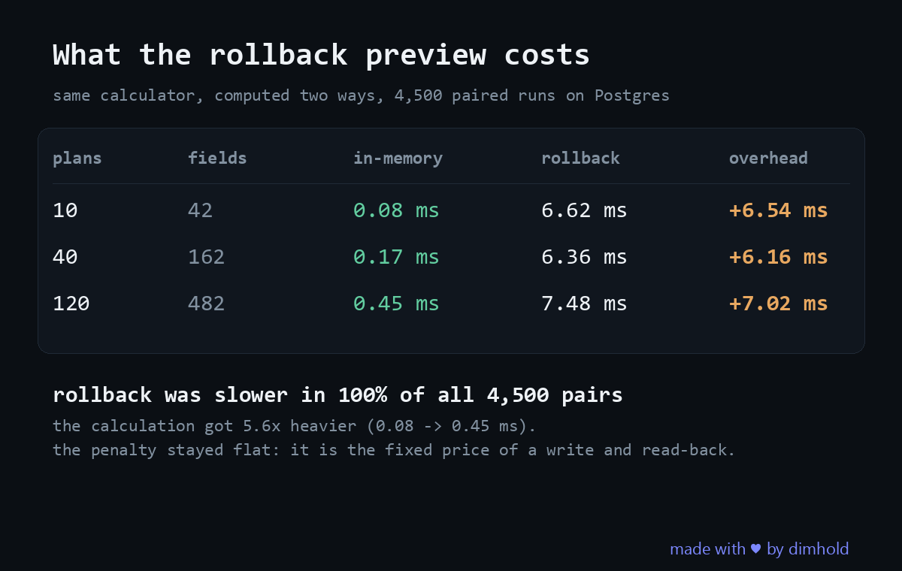

# preview-cost

**A live preview built on a transaction rollback was slower than an in memory copy in 100% of all 4,500 paired runs, and the penalty stayed near 6 to 7 ms even as the calculation itself got 5.6× heavier.**

A runnable, self contained answer to what one architectural choice actually costs. Java 25, no framework, roughly 400 lines.

## The question

A heavy calculator sits behind a slider. Drag the slider and the whole report recomputes. There are two ways to build that preview:

- **A, one engine.** Write the overrides through the normal write path, read the model back the way production reads it, compute, roll the transaction back. Nothing persists. Nothing to keep in sync.
- **B, two engines.** Load the model once, apply the overrides to a copy in memory, compute from that. The database is never touched. Correct only while its view of the model matches what the real read path returns, forever.

B is obviously faster. The interesting question is by how much, because if the gap is small then A buys you a single source of truth for free. The calculation is **literally the same method** in both strategies, so the measurement isolates how the inputs were produced and nothing else.

## The calculator

A month by month projection over a horizon, per plan, carrying subscribers, MRR, cash and a cohort tail. Each month depends on the previous one and each month's revenue sums over every cohort alive so far, so it is O(months² × plans) and cannot be cached by key: change one input and the whole grid is different. `--plans` is the weight knob.

## Method

Three things make these numbers worth quoting, and the first version of this harness had none of them.

- **Paired.** Within one iteration both strategies get the same overrides and run back to back, so every measurement has a partner taken under the same machine conditions. The statistic is the distribution of per pair differences rather than two independent samples compared by eye.
- **Interleaved.** The order flips at random every iteration. Measuring A fully and then B confounds the comparison with anything that drifts during the run: thermal state, background load, and the JIT, which by the end of A's block has already compiled the calculator that B would then be credited for.
- **Forked.** Each configuration runs in several fresh JVMs. Three hundred samples inside one process describe that process rather than the measurement. Per fork medians are printed so that spread stays visible instead of being averaged into one confident looking number.

The interval on the median difference is a 10,000 resample percentile bootstrap over the pairs, which assumes nothing about the shape of the distribution.

## Results

Postgres 16 in Docker, JDK 25, **5 forks × 300 paired previews per configuration = 4,500 pairs**, one connection, no contention.

| plans | fields | A: rollback p50 | (fork medians) | B: in memory p50 | paired median difference | 95% CI |
|---|---|---|---|---|---|---|
| 10 | 42 | 6.62 ms | 5.25–7.63 | 0.08 ms | **6.54 ms** | [6.41, 6.65] |
| 40 | 162 | 6.36 ms | 5.43–7.79 | 0.17 ms | **6.16 ms** | [6.05, 6.26] |
| 120 | 482 | 7.48 ms | 6.67–9.26 | 0.45 ms | **7.02 ms** | [6.84, 7.20] |

Rollback was slower in **100% of all 4,500 pairs**. There is no test to run here. The effect is not a shift in a distribution, it is total separation.

**The overhead is a constant, and that is the finding.** Between the lightest and the heaviest configuration the calculation itself gets 5.6× more expensive (0.08 → 0.45 ms), and the penalty moves from 6.54 ms to 7.02 ms. It is not proportional to the work. It is the fixed price of a transaction, a write and a read back, and you pay it whole every time regardless of what you were computing.

**Fork spread is why one run is not an answer.** At the same configuration, per fork medians for A ranged 5.25 to 7.63 ms, a quarter of the value, on identical inputs on one machine. A single run could honestly have reported either end. The conclusion survives only because the effect is roughly forty times that noise. Had the two strategies been within 2× of each other, this harness could not have told them apart, and neither could anyone else's single run.

**What it means, and it is not what the objection usually assumes.** "Rollback is slow, users will feel it" does not hold: at a 400 ms debounce, 6 ms is invisible. The cost is not the latency. It is that every preview writes rows it immediately discards and holds their locks while it does, so the bill goes to the database and to whoever else touches those rows.

## Reproducing

Needs **JDK 25** and Gradle. H2 in Postgres mode is the default so it runs in ten seconds with nothing installed.

```bash
gradle test                                        # both strategies agree, and A leaves nothing behind
gradle run                                         # H2 in Postgres mode, runs anywhere
gradle run --args="--url jdbc:postgresql://localhost:5432/bench"
gradle run --args="--plans 120 --months 60 --previews 300 --warmup 80"
```

| flag | default | what it does |
|---|---|---|
| `--url` | `jdbc:h2:mem:bench;MODE=PostgreSQL;DB_CLOSE_DELAY=-1` | JDBC url, swap in Postgres for the numbers above |
| `--months` | 60 | projection horizon |
| `--plans` | 40 | weight knob, drives the size of the calculation |
| `--previews` | 300 | paired previews per fork |
| `--warmup` | 80 | discarded iterations before measurement |
| `--fork` | 5 | fresh JVMs per configuration |
| `--seed` | 0 | seed for the generated inputs |

The numbers in this README are from real Postgres, because H2 in memory does not reproduce what a write and discard costs a real database. To get them, point `--url` at a Postgres instance.

## What this is not

Not JMH: no blackhole, no dead code elimination guard beyond accumulating every result, no control over GC or compilation. It does fork, pair and interleave, which is what the first version of this harness got wrong. It measured A fully, then B, in one JVM, so machine drift and JIT warmth were folded into the comparison and a single run's median was quoted as if it were stable.

The bootstrap interval describes sampling error on this machine at this moment. It says nothing about your hardware, your schema, or your connection pool.

One connection, one client, no contention. With concurrent users on the same model, A's lock duration is exactly the part that stops being free, and this harness does not measure that. That is the next thing worth building.

## License

MIT. See [LICENSE](LICENSE).
